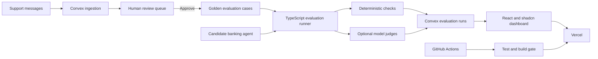

# Architecture

## Components

### Web application

React, TypeScript, Vite, Tailwind CSS, and shadcn/ui primitives. The interface uses a neutral dark theme, a compact top navigation, and a responsive card grid that keeps release readiness prominent. `ConvexProvider` maintains the live connection, while reactive queries update evaluation runs, test cases, and support messages without polling.

### Convex backend

Convex stores support messages, approved evaluation cases, and evaluation run summaries. A reviewed promotion mutation creates a regression case and updates the source message in one transaction. The seed function inserts synthetic starter data only when the deployment is empty.

### Evaluation engine

Pure TypeScript functions check expected intents, required tools, and forbidden tools. Keeping these functions outside the web and database layers makes them easy to run in GitHub Actions.

### Delivery

GitHub Actions runs tests and a production build on every pull request and push to `main`. Vercel deploys the web application from GitHub after the quality gate passes. Convex deploys separately using its deployment key.

### Development workflow

Codex edits the repository, runs tests, reviews changes, and helps maintain the product documents. Codex is not a runtime dependency of the deployed application.
