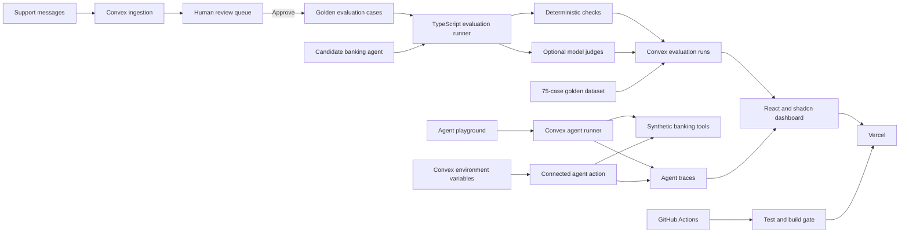

# Architecture

## Components

### Web application

React, TypeScript, Vite, Tailwind CSS, and shadcn/ui primitives. The interface uses a neutral dark theme by default, includes a persistent light-mode switch, and keeps release readiness prominent through a compact top navigation and responsive card grid. Status treatments stay monochrome and pair icons with plain labels instead of relying on red, yellow, or green text. `ConvexProvider` maintains the live connection, while reactive queries update evaluation runs, test cases, and support messages without polling.

### Convex backend

Convex stores support messages, approved evaluation cases, and evaluation run summaries. A reviewed promotion mutation creates a regression case and updates the source message in one transaction. The seed function inserts synthetic starter data only when the deployment is empty.

### Evaluation engine

Pure TypeScript functions check expected intents, required tools, and forbidden tools. Keeping these functions outside the web and database layers makes them easy to run in GitHub Actions.

### Agent playground

The browser sends a support message to a narrow Convex mutation. Shared pure TypeScript logic scores five supported intents, selects a synthetic tool, applies authorization rules, and returns a grounded response. Convex stores the system-prompt version, intent candidates, tool input and result, response, timing, and nine structured trace steps. The table retains the 50 most recent sandbox traces to keep this public demo bounded.

The inspector shows observable decisions and execution data. It does not display private chain-of-thought. No route reads real customer or transaction data.

### Connected agent provider

The connected-agent action reads `AGENT_API_KEY`, `AGENT_MODEL`, `AGENT_API_BASE_URL`, and `AGENT_PROVIDER` from Convex environment variables. The browser receives only connection status and non-secret model metadata. The action asks the model for a structured intent and tool decision, validates both against a fixed inventory, runs a synthetic tool, and asks the model to summarize that result. The trace records the provider, model, prompt version, and dataset version.

The current adapter supports HTTPS endpoints that implement the OpenAI chat-completions format. It cannot call real banking systems. Authentication and authorization must stay in a separate tool gateway before any real integration is added.

### Golden dataset

`banking-support-v1.0` contains 75 synthetic, human-approved cases. It covers failed payments, ATM cash disputes, unrecognized transactions, authorization boundaries, and general support. Each record pins the expected intent, required tool, forbidden tools, risk, category, tags, and dataset version. The seed mutation upserts by case ID, so rerunning it does not create duplicates.

The deterministic evaluation runner executes every versioned case, checks intent and tool behavior with pure TypeScript, and stores both the run summary and 75 case-level results. The first measured baseline passes 32 of 75 cases. It records zero forbidden-tool violations, but its 42.7% intent-and-tool pass rate makes it unsuitable as a release candidate.

### Delivery

GitHub Actions runs tests and a production build on every pull request and push to `main`. Vercel deploys the web application from GitHub after the quality gate passes. Convex deploys separately using its deployment key.

### Development workflow

Codex edits the repository, runs tests, reviews changes, and helps maintain the product documents. Codex is not a runtime dependency of the deployed application.
